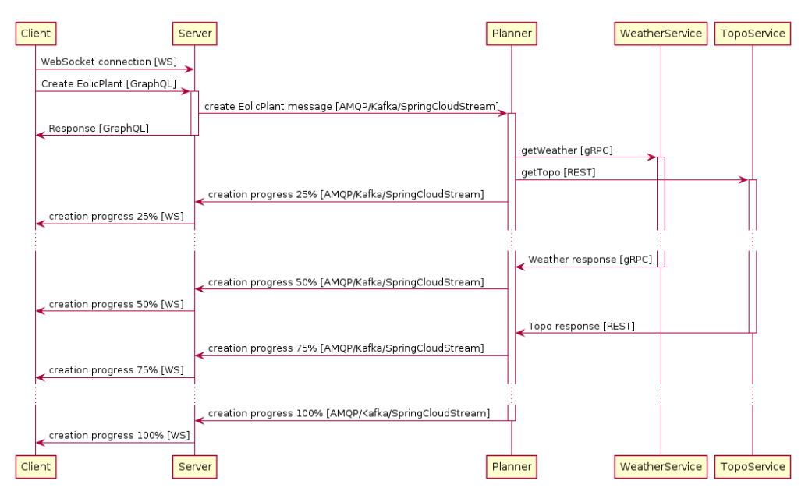
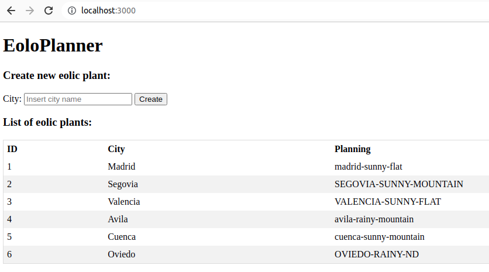

# Práctica 3 Comunicaciones (REST,gRPC y GraphQL)

## Description

Aplicación distribuida para la generación de plantas eólicas: EoloPlanner.
Esta aplicación está compuesta por los siguientes servicios:
- Client: Código JavaScript ejecutado en un navegador web.
- Server: Servidor web que expone una API GraphQL que será usada por el cliente.
- WeatherService: Devuelve información meteorológica.
- TopoService: Devuelve información sobre la orografía del terreno.
Estos servicios se comunican de la siguiente forma:

A continuación se detalla esta comunicación:
- Client usa la API GraphQL para enviar una petición de creación de una Planta Eólica (Create EolicPlant).
- Cuando el Server recibe la petición de creación de una nueva planta eólica del Client, solicita la información meteorológica y topográfica a los servicios WeatherService y TopoService respectivamente.
- El servicio WeatherService ofrecer una interfaz gRPC.
- El servicio TopoService ofrece una interfaz REST.

## System requirements

- Java 17
- Node 16
- Docker 19

## Build

    > npm install
    > node install.js

Descarga las dependencias y construye los 3 proyectos

## Start Docker DB images

    > node exec_aux_services.js

El script descargará e iniciará las imagenes de MySQL y Mongo necesarias para persistir la información.

## Setup 

    > node exec.js

Este script levanta las 3 aplicaciones:

- weatherservice : http://localhost:9090 (gRPC)
- toposervice : http://localhost:8080 (REST)
- server : http://localhost:3000 (GraphQL)

## Predefined data

Para poder probar en el arranque de toposervice se dá de alta las sigueintes ciudades con estas características:

    new City("madrid", "flat"),
    new City("barcelona", "flat"),
    new City("valencia", "flat"),
    new City("sevilla", "flat"),
    new City("albacete", "flat"),
    new City("segovia", "mountain"),
    new City("avila", "mountain"),
    new City("cuenca", "mountain"),
    new City("toledo", "mountain"),
    new City("guadalajara", "mountain"),
    new City("bilbao", "mountain"));

## How to test
 
El servidor dispone de un cliente estático para visualizar las plantas eólicas existentes e insertar nuevas plantas eólicas. Accediendo desde [localhost:3000](http://localhost:3000) donde se encontrará el portal de gestión.

También se pueden probar los endpoints usando [Postman Collection](./Practica3.postman_collection.json)